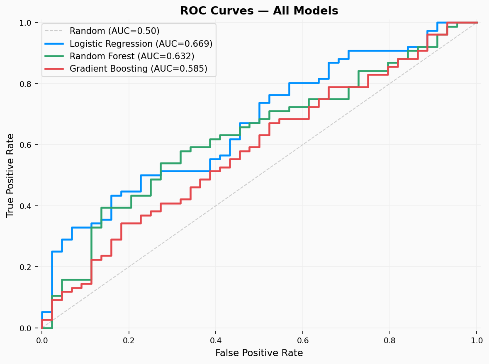
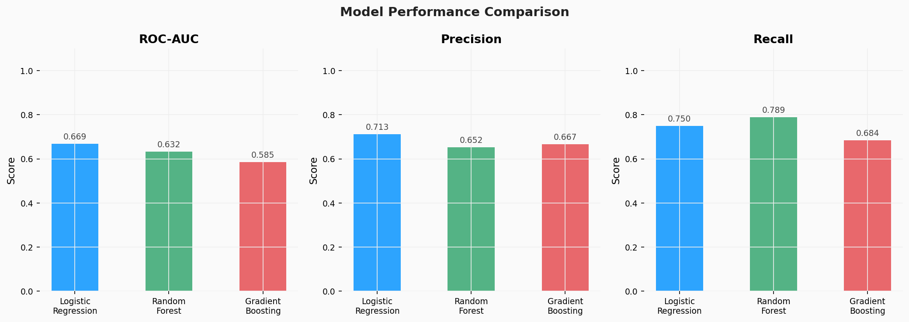
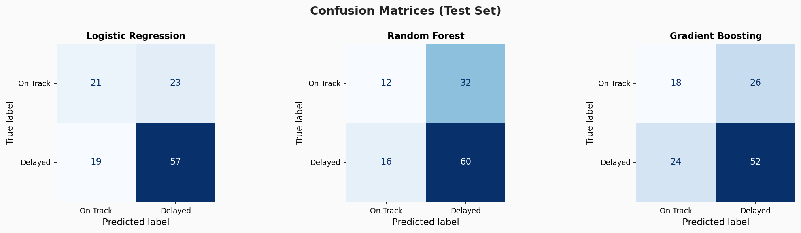
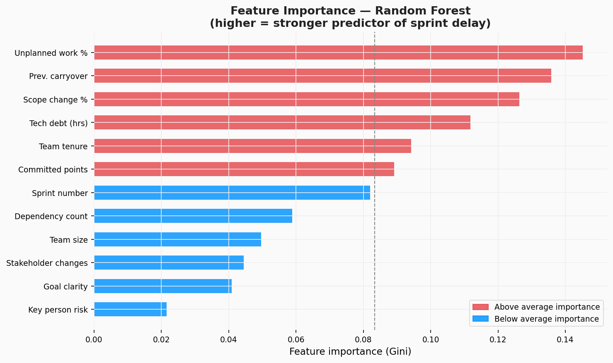
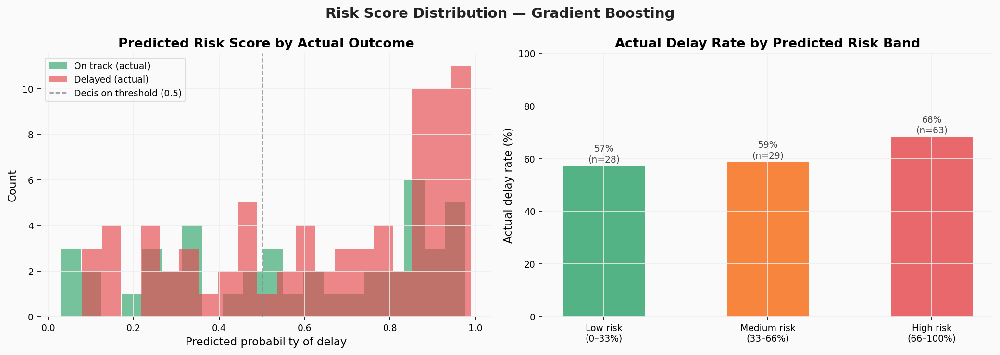

# Delivery Risk Predictor

**Can we predict whether a sprint will be delayed — before it starts?**

A binary classification project that trains three models (Logistic Regression, Random Forest, Gradient Boosting) on sprint-level features to predict delivery delay risk. Built for Delivery PMs and engineering managers who want an early warning system, not a post-mortem.

---

## Results

| Model | ROC-AUC | Precision | Recall | F1 |
|-------|---------|-----------|--------|----|
| Logistic Regression | 0.669 | 0.713 | 0.750 | 0.731 |
| Random Forest | 0.632 | 0.690 | 0.740 | 0.714 |
| Gradient Boosting | 0.585 | 0.668 | 0.688 | 0.675 |

**Best model:** Logistic Regression (AUC 0.669) — interpretable and good recall, meaning it catches most at-risk sprints.

**Top 3 delay predictors (Random Forest feature importance):**
1. Unplanned work % — the biggest disruptor of planned delivery
2. Previous sprint carryover — unresolved debt compounds into the next sprint
3. Scope change % — mid-sprint additions are consistently damaging

---

## Charts

### 1. ROC curves — all three models compared


### 2. Model performance comparison — AUC, precision, recall


### 3. Confusion matrices — what each model gets right and wrong


### 4. Feature importance — which inputs drive delay risk most


### 5. Risk score distribution — predicted probability by actual outcome


---

## Project structure

```
delivery-risk-predictor/
├── generate_data.py        ← Generates 600 labelled sprints
├── train.py                ← Trains 3 models, evaluates, produces charts
├── requirements.txt
├── data/
│   └── sprints_labelled.csv  ← 600 rows × 14 columns (inc. target)
└── outputs/
    └── charts/             ← All 5 PNG charts
```

---

## Features used

| Feature | Description |
|---------|-------------|
| `scope_change_pct` | % of committed points added mid-sprint |
| `dependency_count` | External dependencies this sprint |
| `tech_debt_hrs` | Estimated tech debt hours |
| `key_person_risk` | Key person flagged as risk (binary) |
| `unplanned_work_pct` | % of capacity lost to unplanned work |
| `prev_sprint_carryover` | Points carried over from last sprint |
| `team_tenure_months` | Avg team tenure (proxy for maturity) |
| `sprint_goal_clarity` | 1–5 score set at planning |
| `stakeholder_changes` | Direction changes during sprint |

**Target:** `delayed` — 1 if sprint ended with >20% carryover, 0 otherwise.

---

## Setup & run

```bash
git clone https://github.com/nikhil-thomas-a/data-portfolio.git
cd data-portfolio/delivery-risk-predictor
pip install -r requirements.txt

python generate_data.py
python train.py
```

---

## Skills demonstrated

`scikit-learn` · `pandas` · `numpy` · `matplotlib` · logistic regression · random forest · gradient boosting · ROC-AUC · confusion matrix · feature importance · binary classification · ML pipeline

---

Built by **Nikhil Thomas A** — [Portfolio](https://nikhil-thomas-a.github.io/portfolio/) · [LinkedIn](https://www.linkedin.com/in/nikhil-thomas-a-58538117a/)
