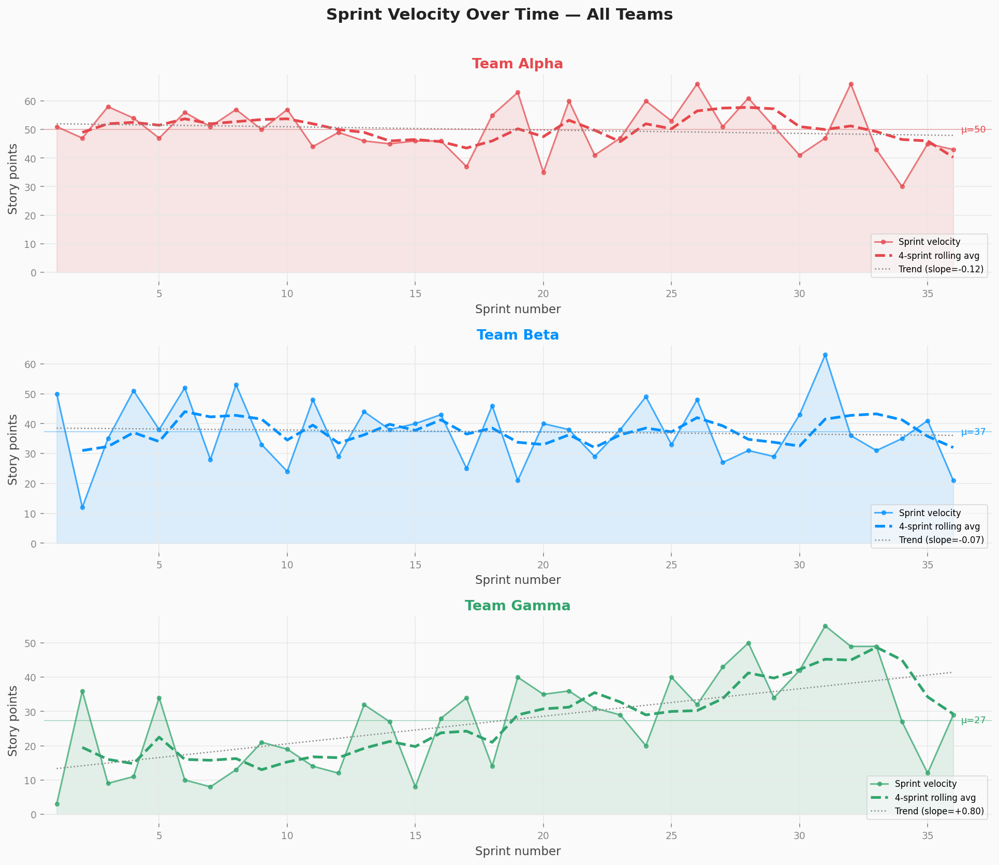
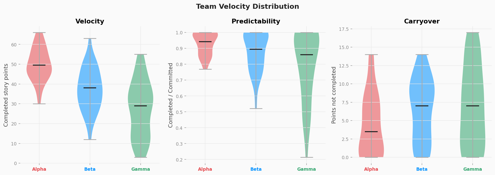
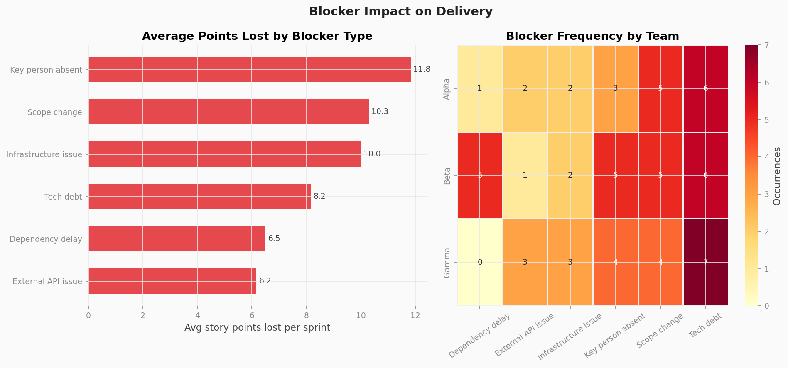
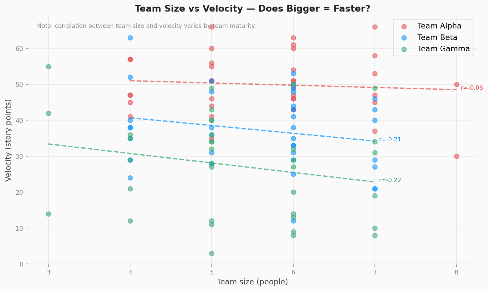
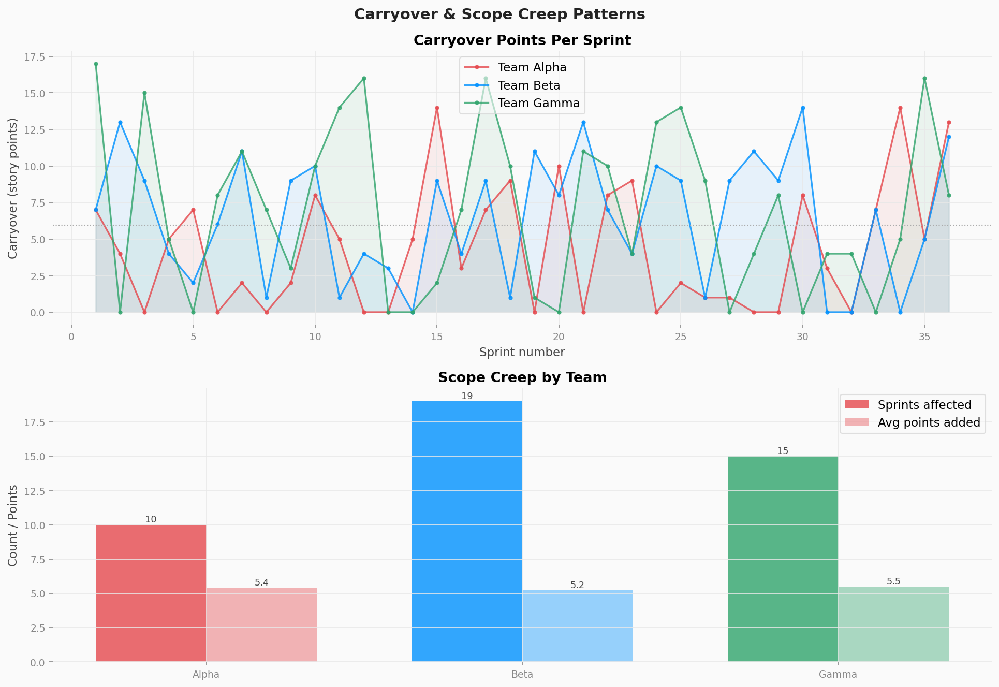
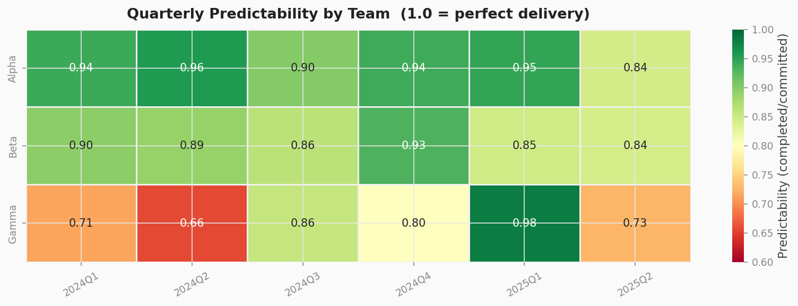

# Sprint Velocity Analyser

**What predicts a delivery team going off track?**

A full exploratory data analysis of sprint performance across three engineering teams over 18 months. Covers velocity trends, predictability, blocker impact, scope creep, and team size effects.

Built as a practical tool for Delivery PMs and engineering managers who want to move beyond gut feel and answer delivery questions with data.

---

## Key findings

| Team  | Avg velocity | Predictability | Trend | Top blocker |
|-------|-------------|----------------|-------|-------------|
| Alpha | 50 pts      | 92.9%          | Flat (stable senior team) | Tech debt |
| Beta  | 37 pts      | 88.1%          | Slight positive            | Tech debt |
| Gamma | 27 pts      | 79.8%          | **+0.8 pts/sprint** (clear learning curve) | Tech debt |

**Headline insights:**
- Team Gamma shows statistically significant velocity improvement (r=0.61, p<0.001) — a new team finding its rhythm
- "Key person absent" causes the highest average points lost per sprint (12+ pts) across all teams
- Scope creep affects ~40% of sprints and correlates with increased carryover the following sprint
- Team size alone is a weak predictor of velocity — maturity and consistency matter more
- Tech debt is the most frequent recurring blocker across all three teams

---

## Charts

### 1. Velocity trends — is each team getting faster, slower, or staying flat?


### 2. Team comparison — velocity, predictability, and carryover distributions


### 3. Blocker impact — which blocker types cost the most story points?


### 4. Team size vs velocity — does adding people actually increase output?


### 5. Carryover & scope creep — when do teams overcommit?


### 6. Predictability heatmap — consistency by team, quarter by quarter


---

## Project structure

```
sprint-velocity-analyser/
├── generate_data.py        ← Creates synthetic sprint data (run first)
├── analyse.py              ← Full EDA + all charts
├── requirements.txt
├── data/
│   └── sprints.csv         ← 108 sprint records, 3 teams, 18 months
└── outputs/
    ├── summary_stats.csv   ← Per-team aggregated stats
    └── charts/             ← All 6 PNG charts
```

---

## Dataset

Synthetic data generated with realistic parameters for three teams:

- **Team Alpha** — stable senior team, consistent velocity (~50 pts/sprint)
- **Team Beta** — mid-maturity team with gradual improvement
- **Team Gamma** — newer team, high variance, clear learning curve

17 features per sprint including: committed points, scope added, completed points, carryover, primary blocker, team size, bugs reported, unplanned work %, and ceremony hours.

---

## Setup & run

```bash
# Clone and install
git clone https://github.com/nikhil-thomas-a/data-portfolio.git
cd data-portfolio/sprint-velocity-analyser
pip install -r requirements.txt

# Generate data
python generate_data.py

# Run analysis (outputs all charts)
python analyse.py
```

---

## Skills demonstrated

`pandas` · `numpy` · `matplotlib` · `seaborn` · `scipy.stats` · EDA · data visualisation · regression analysis · synthetic data generation

---

## About

Built by **Nikhil Thomas A** — Delivery PM & Fractional Head of Data.

This project is part of a series exploring data analytics applied to PM and ops problems.

🔗 [Portfolio](https://nikhil-thomas-a.github.io/portfolio/) · [LinkedIn](https://www.linkedin.com/in/nikhil-thomas-a-58538117a/)
