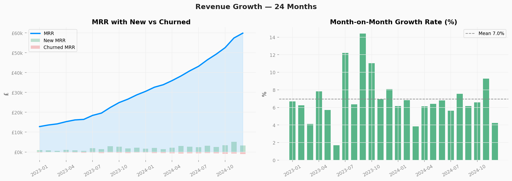
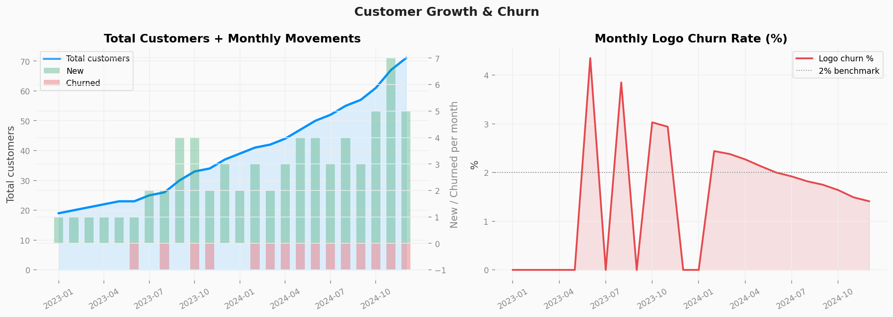
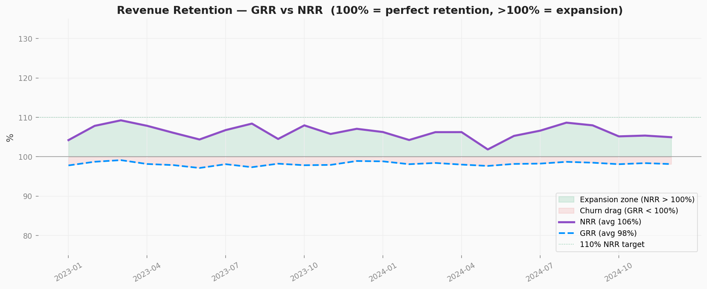
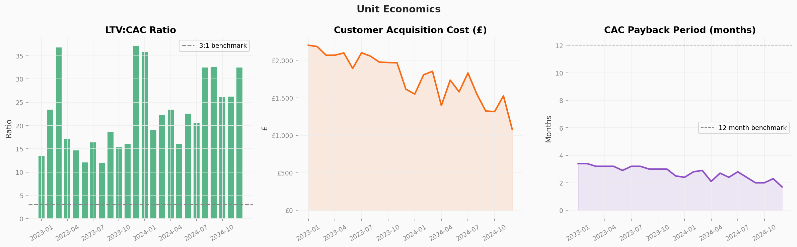
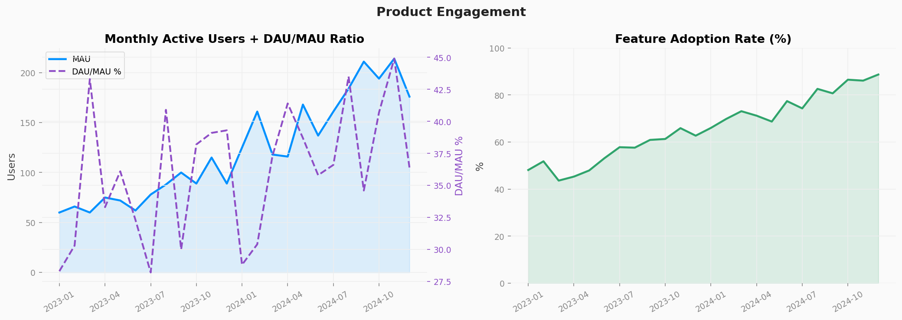
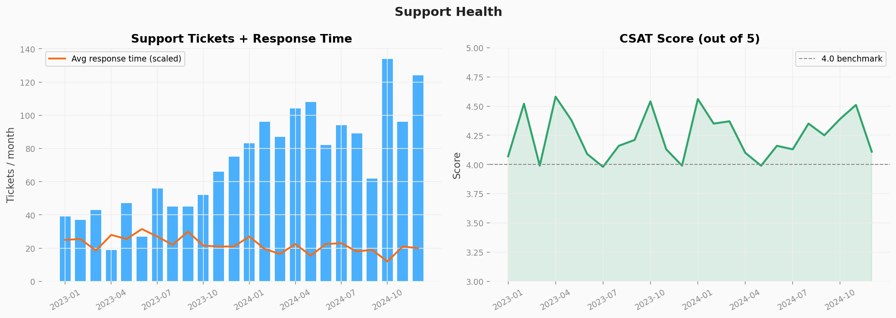
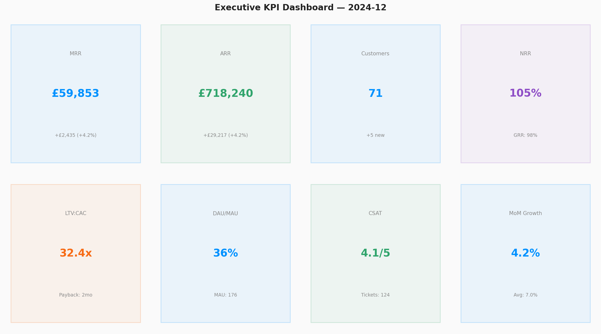

# Startup KPI Dashboard

**What does healthy SaaS growth actually look like — month by month?**

End-to-end analysis of 24 months of synthetic SaaS KPI data, covering the full metrics stack that investors and operators use to track startup health: revenue, retention, unit economics, product engagement, and support.

---

## Key numbers (month 24)

| Metric | Value |
|--------|-------|
| MRR | £59,853 |
| ARR | £718,240 |
| MRR growth (24 months) | +368% |
| Average NRR | 106% |
| Average LTV:CAC | 22.6x |
| Final CSAT | 4.1/5 |

---

## Charts

### 1. Revenue trajectory — MRR growth with new vs churned breakdown


### 2. Customer growth and logo churn


### 3. Retention — GRR vs NRR over time


### 4. Unit economics — LTV:CAC, CAC trend, payback period


### 5. Product engagement — MAU, DAU/MAU ratio, feature adoption


### 6. Support health — ticket volume and CSAT


### 7. Executive summary dashboard


---

## Project structure

```
startup-kpi-dashboard/
├── generate_data.py        ← Generates 24 months of SaaS KPI data
├── analyse.py              ← Full analysis + all 7 charts
├── requirements.txt
├── data/
│   └── kpi_monthly.csv     ← 24 rows × 25 columns
└── outputs/
    └── charts/             ← All 7 PNG charts
```

---

## Metrics covered

**Revenue:** MRR, ARR, new MRR, expansion MRR, churned MRR, MoM growth rate

**Customers:** Total, new per month, churned per month, logo churn rate

**Retention:** Gross Revenue Retention (GRR), Net Revenue Retention (NRR)

**Unit economics:** CAC, LTV, LTV:CAC ratio, payback period (months)

**Product:** MAU, DAU, DAU/MAU ratio, feature adoption rate

**Support:** Tickets per month, avg response time (hrs), CSAT score

---

## Setup & run

```bash
git clone https://github.com/nikhil-thomas-a/data-portfolio.git
cd data-portfolio/startup-kpi-dashboard
pip install -r requirements.txt

python generate_data.py
python analyse.py
```

---

## Skills demonstrated

`pandas` · `numpy` · `matplotlib` · SaaS metrics · revenue analysis · retention modelling · unit economics · executive dashboarding

---

Built by **Nikhil Thomas A** — [Portfolio](https://nikhil-thomas-a.github.io/portfolio/) · [LinkedIn](https://www.linkedin.com/in/nikhil-thomas-a-58538117a/)
